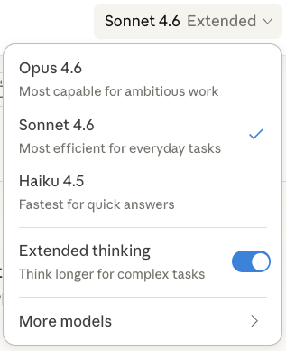

# Pure Vibes (Pd-vibes)

**Pure Vibes is an experimental, lightweight extension to [Pure Data](https://puredata.info) allowing for AI agent control.** It is vibe-coded and intended for experimental use only. It is not affiliated with or endorsed by Miller Puckette or the Pure Data community.

Pure Vibes integrates a [Model Context Protocol (MCP)](https://modelcontextprotocol.io/) directly into Pure Data, allowing AI agents (Claude, ChatGPT, etc.) to read, create, and manipulate Pd patches in real time. Once Pure Vibes is installed on your machine and registered w/ your AI agent, you can ask it to do things in natural language like "explain this patch I'm working on" or "build me a new 8 voice FM osc patch w/ real-time MIDI control".

---

## Quick Start with Claude Desktop (macOS / Windows)

### 1. Install and launch Pd-vibes

Download the latest release for your platform from the **[Releases](../../releases)** tab:

- **macOS**: Download `Pd-vibes-macos.zip`, unzip, drag `Pd-vibes.app` to Applications.
  - On first launch, macOS may warn that it "can't check the app for malicious software."
  - Right-click the app in Finder, choose **Open**, then click **Open** again to bypass this.
  - Alternatively, go to **System Settings > Privacy & Security**, scroll down to the Security section, and click **Open Anyway** next to the Pd-vibes message.
- **Windows**: Download `Pd-vibes-windows-x86_64-installer.exe`, run the installer, then launch Pd from the Start menu or desktop shortcut.

Launch Pd-vibes. The MCP server starts automatically, and Pd-vibes will attempt to automatically register itself in your Claude Desktop configuration file.

### 2. Install Claude Desktop

If you haven't already:

1. Download and install [Claude Desktop](https://claude.ai/download).
2. Create a free account (or sign in if you already have one).
3. Once signed in, go to a new chat.
4. **Choose a model:** If you're on a free account, select **Sonnet 4.6** with **Extended thinking** enabled (see below). If you have a paid account, select **Opus 4.6** with **Extended thinking** for the best results.



If Claude Desktop was already running when you first launched Pd-vibes, **fully quit and re-open it** (macOS: **Cmd+Q**, Windows: **File > Quit**) so it picks up the new MCP configuration.

To verify the connection: ask Claude _"Can you see the Pure Vibes MCP tools?"_ or go to **Settings > Developer** in Claude Desktop.

### 3. Try it out

Ask Claude:

> "Using Pure Vibes, build me a simple synthesizer in Pure Data with an oscillator, envelope, and volume control"

Claude will use the MCP tools to create objects, wire them together, and you will see the patch build itself in real time.

Other things to try:

> "What patches do I have open?"

> "Turn on DSP"

> "Add a reverb to my patch"

---

## Other Installation Methods

### Manual Claude Desktop registration

If auto-registration doesn't work or you want custom configuration (e.g. a different port or pointing at a remote machine), edit the Claude Desktop config file directly.

**macOS** — `~/Library/Application Support/Claude/claude_desktop_config.json`:

> **Tip:** In Finder, press **Cmd+Shift+G** and paste `~/Library/Application Support/Claude/` to open the folder.

```json
{
  "mcpServers": {
    "Pure Vibes": {
      "command": "/Applications/Pd-vibes.app/Contents/Resources/bin/pd-mcp"
    }
  }
}
```

**Windows** — `%APPDATA%\Claude\claude_desktop_config.json`:

```json
{
  "mcpServers": {
    "Pure Vibes": {
      "command": "C:\\Program Files\\pd-vibes\\bin\\pd-mcp.exe"
    }
  }
}
```

Fully quit and re-open Claude Desktop after saving the config.

### Register w/ Cursor

**Prerequisite:** Launch Pd-vibes first so its MCP server is running (`pd-mcp` talks to the running instance over localhost). Cursor does not auto-register Pd-vibes; add the server manually.

**1. Choose a config location**

- **Project** — Create or edit `.cursor/mcp.json` in your repo (good for sharing or per-project setup).
- **Global** — Create or edit `~/.cursor/mcp.json` so Pure Vibes is available in every workspace.

**2. Add a `stdio` entry for `pd-mcp`**

Use the same binary path as in [Manual Claude Desktop registration](#manual-claude-desktop-registration) (release app) or your build’s `bin/pd-mcp`. After saving, **restart Cursor** (or disable and re-enable the server under **Settings → Features → Model Context Protocol**) so the config loads.

**macOS** — `.cursor/mcp.json` or `~/.cursor/mcp.json`:

```json
{
  "mcpServers": {
    "Pure Vibes": {
      "type": "stdio",
      "command": "/Applications/Pd-vibes.app/Contents/Resources/bin/pd-mcp"
    }
  }
}
```

**Windows** — use your install path, for example:

```json
{
  "mcpServers": {
    "Pure Vibes": {
      "type": "stdio",
      "command": "C:\\Program Files\\pd-vibes\\bin\\pd-mcp.exe"
    }
  }
}
```

**Dev / Linux (local Pd):** point `command` at your clone’s `bin/pd-mcp`, e.g. `"command": "/path/to/pure-vibes/bin/pd-mcp"`.

**Remote Pd on another machine:** add `"args": ["--host", "192.168.1.42"]` (and optionally `"--port", "4330"`) to the server object, matching [Remote control](#remote-control-pd-on-linux-claude-desktop-on-macwindows). Use the `pd-mcp` binary from your Cursor machine’s Pd-vibes install.

**3. Verify**

Under **Settings → Features → Model Context Protocol**, confirm **Pure Vibes** is listed and enabled. In Agent chat, ask whether the Pure Vibes MCP tools are visible, or check **Output → MCP Logs** if something fails to connect.

### Linux with Claude Code

[Claude Code](https://claude.ai/code) is Anthropic's official CLI and runs natively on Linux, making it the easiest way to use Pure Vibes on Linux.

**1. Build Pure Vibes from source** (if you haven't already):

```sh
sudo apt-get install -y autoconf automake libtool gettext \
    libasound2-dev libjack-jackd2-dev tcl-dev tk-dev
./autogen.sh
./configure
make -j$(nproc)
```

**2. Register `pd-mcp` with Claude Code:**

```sh
claude mcp add pure-vibes /path/to/pure-vibes/bin/pd-mcp
```

Replace `/path/to/pure-vibes` with the actual path to your clone (e.g. `~/dev/pure-vibes`).

**3. Launch Pure Vibes** (MCP starts automatically):

```sh
/path/to/pure-vibes/bin/pd
```

Or headless (no GUI), passing a patch to load:

```sh
/path/to/pure-vibes/bin/pd -nogui -send "pd dsp 1" mypatch.pd
```

**4. Start Claude Code** in your project directory:

```sh
claude
```

The `pure-vibes` MCP server will connect automatically. You can verify with `/mcp` and then ask Claude to build patches:

> "Using Pure Vibes, build me a waves-on-a-beach ambient sound patch"

### Remote control (Pd on Linux, Claude Desktop on Mac/Windows)

You can run **Pure Vibes on a Linux machine** and control it via **Claude Desktop on a Mac or Windows machine** on the same local network.

**On the Linux machine:**

1. Launch Pd-vibes (MCP starts automatically).
2. Allow network connections — in the Media menu, enable **MCP Allow Network** (or launch with `-mcpnetwork`). This lets Claude Desktop reach Pd-vibes from another machine.
3. Note your Linux machine's local IP address (e.g. `192.168.1.42`) — you'll need it in the next step.

**On your Mac or Windows machine (where Claude Desktop runs):**

Point Claude Desktop at `pd-mcp` with the `--host` flag so it forwards tool calls to your Linux machine. The `pd-mcp` binary ships with Pd-vibes for all platforms — use the one from whichever Pd-vibes install you have on the host machine.

macOS config (`~/Library/Application Support/Claude/claude_desktop_config.json`):

```json
{
  "mcpServers": {
    "Pure Vibes (Remote)": {
      "command": "/Applications/Pd-vibes.app/Contents/Resources/bin/pd-mcp",
      "args": ["--host", "192.168.1.42"]
    }
  }
}
```

Windows config (`%APPDATA%\Claude\claude_desktop_config.json`):

```json
{
  "mcpServers": {
    "Pure Vibes (Remote)": {
      "command": "C:\\Program Files\\pd-vibes\\bin\\pd-mcp.exe",
      "args": ["--host", "192.168.1.42"]
    }
  }
}
```

Replace `192.168.1.42` with your Linux machine's actual IP address. If you changed the MCP port from the default (4330), also add `"--port", "YOURPORT"` to `args`.

Fully quit and re-open Claude Desktop after saving the config.

---

## Pure Data tools exposed by the MCP

The built-in MCP server exposes 24 tools:

| Category    | Tools                                                                      |
| ----------- | -------------------------------------------------------------------------- |
| Patches     | `list_patches`, `get_patch_state`, `open_patch`, `save_patch`, `new_patch` |
| Objects     | `create_object`, `delete_object`, `modify_object`, `move_object`           |
| Connections | `connect`, `disconnect`                                                    |
| Batch       | `batch_update`, `clear_patch`                                              |
| Runtime     | `send_message`, `send_bang`, `set_number`                                  |
| DSP         | `set_dsp`, `get_dsp_state`                                                 |
| Multimodal  | `get_audio_rms`                                                            |
| Selection   | `get_selection`                                                            |
| Docs        | `list_object_names`, `get_object_doc`                                      |
| Other       | `get_audio_midi_settings`, `get_pd_log`                                    |

---

## Advanced Configuration

### Connect to other MCP clients

Pd-vibes supports two MCP connection modes:

- **Claude Desktop via stdio proxy**: Point Claude at `pd-mcp`. The proxy speaks stdio to Claude and forwards tool calls to Pd-vibes over HTTP on localhost.
- **Direct Streamable HTTP**: Pd-vibes listens on `http://localhost:4330/mcp` when MCP is enabled. Any MCP client that supports Streamable HTTP should be able to connect directly, though this has not been extensively tested.

### MCP Configuration

- **Toggle**: Check/uncheck "MCP" in the main Pd window, or use the Media menu
- **Port**: Media > MCP Port... (default: 4330). CLI: `-mcpport 4331`
- **Network**: Media > MCP Allow Network (default: localhost only). CLI: `-mcpnetwork`
- **Default state**: MCP is on by default (port 4330, localhost only)
- **Disable**: Uncheck "MCP" in the main window, or start with `-nomcp`
- **Auto-registration**: On macOS and Windows, Pd-vibes automatically registers itself with Claude Desktop on first launch. Build-from-source installs register as "Pure Vibes (Dev)"

---

## Building from Source

### macOS (arm64 / x86_64)

Install Xcode command line tools and Homebrew, then:

```sh
brew install autoconf automake libtool gettext
LIBTOOLIZE=$(brew --prefix libtool)/bin/glibtoolize ./autogen.sh
./configure
make -j$(sysctl -n hw.logicalcpu)
```

To create an app bundle:

```sh
make app
# Creates Pd-vibes.app in the build directory
```

### Linux (Debian/Ubuntu)

```sh
sudo apt-get install autoconf automake libtool gettext \
    libasound2-dev libjack-jackd2-dev tcl-dev tk-dev
./autogen.sh
./configure
make -j$(nproc)
sudo make install
```

### Windows (MSYS2)

Install [MSYS2](https://www.msys2.org), open a MINGW64 shell, then:

```sh
pacman -S mingw-w64-x86_64-gcc mingw-w64-x86_64-autotools make autoconf automake libtool
./autogen.sh
./configure
make -j$(nproc)
```

For more detailed build instructions, see INSTALL.txt.

---

## About Pure Data

Pure Data (Pd) is a free, open-source visual programming language for multimedia,
created by Miller Puckette. For information about vanilla Pd, visit:

- https://puredata.info
- http://msp.ucsd.edu/software.html

---

## Copyright & Licensing

### Pure Data

Except as otherwise noted, all files in the Pd distribution are:

    Copyright (c) 1997-2024 Miller Puckette and others.

Licensed under the **BSD 3-Clause License**. See LICENSE.txt for details.

### cJSON (embedded JSON library)

The files `src/mcp/cJSON.c` and `src/mcp/cJSON.h` are from the
[cJSON](https://github.com/DaveGamble/cJSON) project (v1.7.18):

    Copyright (c) 2009-2017 Dave Gamble and cJSON contributors.

Licensed under the **MIT License**. The full license text is included at the
top of each file.

### MCP Server Code

The files `src/mcp/mcp_server.c`, `src/mcp/mcp_server.h`,
`src/mcp/mcp_tools.c`, `src/mcp/mcp_tools.h`, and `src/mcp/mcp_proxy.c`
are new additions to this fork, written for the Pure Vibes project.
They are released under the same
**BSD 3-Clause License** as the rest of Pure Data.

### Compatibility

The BSD 3-Clause (Pd) and MIT (cJSON) licenses are fully compatible.
Both are permissive open-source licenses that allow free use, modification,
and redistribution.

---

## Acknowledgements

The development of _Pure Vibes_ was supported by the [Humanities and AI Virtual Institute (HAVI)](https://www.schmidtsciences.org/humanities-and-ai-virtual-institute/), a program of Schmidt Sciences.
